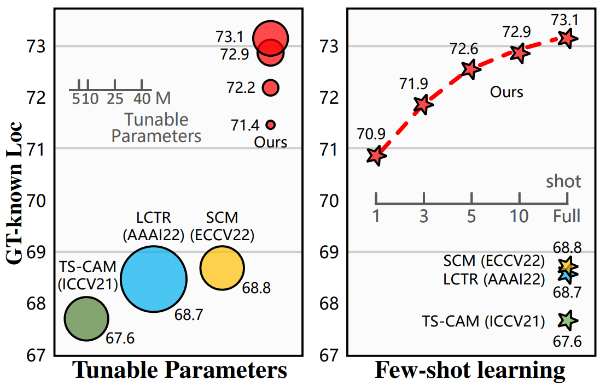
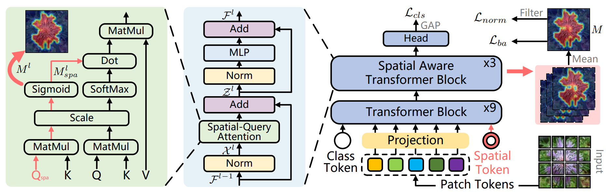
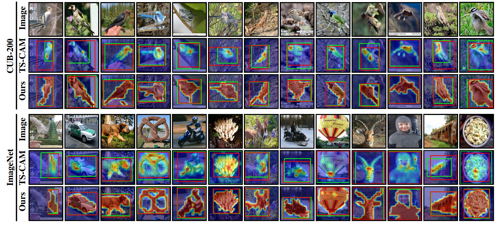
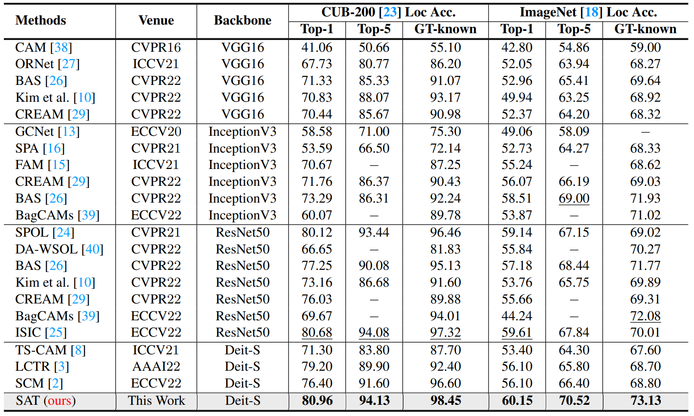

# Spatial-Aware Token for Weakly Supervised Object Localization (ICCV23)

PyTorch implementation of ''Spatial-Aware Token for Weakly Supervised Object Localization''. This repository contains PyTorch training code, inference code and pretrained models. 

## 📋 Table of content
 1. [📎 Paper Link](#1)
 2. [💡 Abstract](#2)
 4. [📖 Method](#4)
 6. [✏️ Usage](#6)
    1. [Start](#61)
    2. [Download Datasets](#62)
    4. [Inference](#63)
 7. [⛺ Experimental Results and Model Zoo](#7)
 8. [📊 Experimental Results](#8)
 9. [✉️ Statement](#9)

## 📎 Paper Link <a name="1"></a> 

* Spatial-Aware Token for Weakly Supervised Object Localization

    Authors: Pingyu Wu*, Wei Zhai*, Yang Cao, Jiebo Luo, Zheng-Jun Zha

## 💡 Abstract <a name="2"></a> 
Weakly supervised object localization (WSOL) is a challenging task aiming to localize objects with only image-level supervision. Recent works apply visual transformer to WSOL and achieve significant success by exploiting the long-range feature dependency in self-attention mechanism. However, existing transformer-based methods synthesize the classification feature maps as the localization map, which leads to optimization conflicts between classification and localization tasks. To address this problem, we propose to learn a task-specific spatial-aware token (SAT) to condition localization in a weakly supervised manner. Specifically, a spatial token is first introduced in the input space to aggregate representations for localization task. Then a spatial aware attention module is constructed, which allows spatial token to generate foreground probabilities of different patches by querying and to extract localization knowledge from the classification task. Besides, for the problem of sparse and unbalanced pixel-level supervision obtained from the image-level label, two spatial constraints, including batch area loss and normalization loss, are designed to compensate and enhance this supervision. Experiments show that the proposed SAT achieves state-of-the-art performance on both CUB-200 and ImageNet, with 98.45% and 73.13% GT-known Loc, respectively. Even under the extreme setting of using only 1 image per class from ImageNet for training, SAT already exceeds the SOTA method by 2.1% GT-known Loc. Code and models are available at https://github.com/wpy1999/SAT.


<p align="center">
     <br />
    <em> 
    </em>
</p>

**GT-known Loc on ImageNet.** The proposed method only needs to fine-tune a small number of parameters or requires a few training images to achieve significant improvement.


## 📖 Method <a name="4"></a> 

<p align="center">
     <br />
    <em> 
    </em>
</p>

**Framework of SAT.** It includes three spatial aware transformer blocks at the end of the network. Each block generates a localization map $M^{l}$ using the spatial-query attention module. The final localization map $M$ is obtained by fusing $M^{l}$ of different layers.


## ✏️ Usage <a name="6"></a> 

### Start <a name="61"></a> 

```bash  
git clone https://github.com/wpy1999/SAT.git
cd SAT
```

### Download Datasets <a name="62"></a> 

* CUB ([http://www.vision.caltech.edu/visipedia/CUB-200-2011.html](http://www.vision.caltech.edu/visipedia/CUB-200-2011.html))
* ILSVRC ([https://www.image-net.org/challenges/LSVRC/](https://www.image-net.org/challenges/LSVRC/))


### Inference <a name="63"></a> 

To test the localization accuracy on CUB-200, you can download the trained models from Model Zoo, then run `evaluator.py`:
```bash  
python evaluator.py  
```

To test the localization accuracy on ILSVRC, you can download the trained models from Model Zoo, then run `evaluator_ImageNet.py`:
```bash  
python evaluator_ImageNet.py 
```


## ⛺ Experimental Results and Model Zoo <a name="7"></a> 
You can download all the trained models here  ([Google Drive]( https://drive.google.com/drive/folders/1iizD8bHjHrzfIUFpHpVGO1k68FSjdtSP?usp=sharing))

 or download any one individually as follows:


|  | Top1 Loc | Top5 Loc | GT Known |  Weights  |
| :-----: | :----: | :----: | :----: | :----: |
| CUB-200 | 80.96 | 94.13 | 98.45 | [Google Drive]( https://drive.google.com/drive/folders/1JsLA_Ji8ienM82Y-beGWqOAUXRYPlSKm?usp=sharing)|
| ILSVRC | 60.15 | 70.52 | 73.13 | [Google Drive]( https://drive.google.com/drive/folders/1vuDxx_CyG0_U80eo6SW4-YV7M4rybZP7?usp=sharing) |


## 📊 Experimental Results <a name="8"></a> 

<p align="center">
     <br />
    <em> 
    </em>
</p>

<p align="center">
     <br />
    <em> 
    </em>
</p>


## ✉️ Statement <a name="9"></a> 
This project is for research purpose only, please contact us for the licence of commercial use. For any other questions please contact [wpy364755620@mail.ustc.edu.cn](wpy364755620@mail.ustc.edu.cn) or [wzhai056@ustc.edu.cn](wzhai056@ustc.edu.cn).


